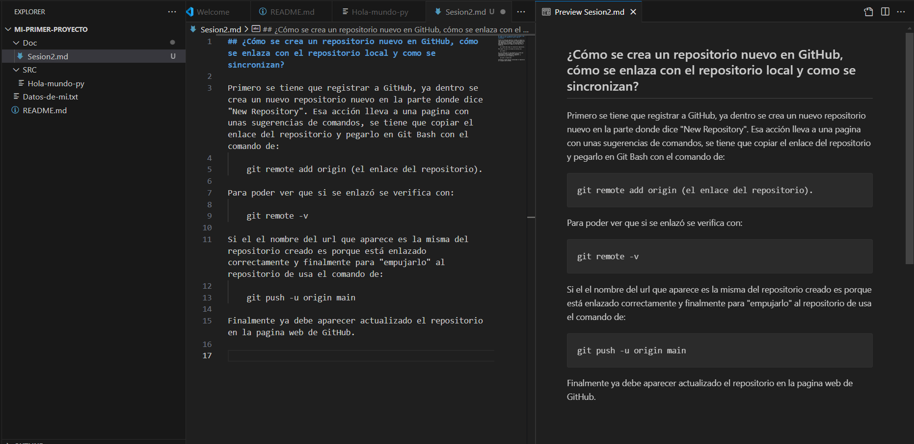

## ¿Cómo se crea un repositorio nuevo en GitHub, cómo se enlaza con el repositorio local y como se sincronizan?

Primero se tiene que registrar a GitHub, ya dentro se crea un nuevo repositorio nuevo en la parte donde dice "New Repository". Esa acción lleva a una pagina con unas sugerencias de comandos, se tiene que copiar el enlace del repositorio y pegarlo en Git Bash con el comando de:

    git remote add origin (el enlace del repositorio).

Para poder ver que si se enlazó se verifica con: 

    git remote -v

Si el el nombre del url que aparece es la misma del repositorio creado es porque está enlazado correctamente y finalmente para "empujarlo" al repositorio de usa el comando de:

    git push -u origin main

Finalmente ya debe aparecer actualizado el repositorio en la pagina web de GitHub.

